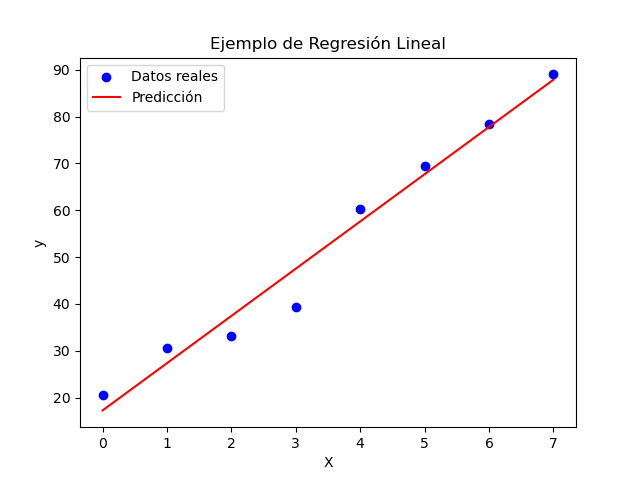

Universidad Católica Andrés Bello
Escuela de Informática
Inteligencia Artificial: Aprendizaje Automático
Semestre Marzo-Julio de 2026

# Laboratorio de Regresión

El objetivo del laboratorio es el de realizar regresiones lineales de datos, para realizar predicciones
sobre los mismos. Se requiere que realice las siguientes actividades usando la librería Scikit-learn.

## 1. Actividad perdición de ventas

En el archivodatosVentas.csvse encuentran los datos de las ventas anuales de la tiendaSiempreTuAmigo.
Ellos quieren que usted le pronostique, cual será el número de ventas en el año 2026, dado su histórico
de ventas. Para obtener esa predicción, debe realizar un modelo de regresión lineal sobre los datos da-
dos. Debe presentar como resultados: (i) la predicción de ventas para el año 2026, (ii) el coeficiente del
modelo (esto es _modelo_. _coef_ ), (iii) el intercepto del modelo (esto es _modelo_. _coef_ ), (iv) y la gráfica
que contenga los datos del problema junto con la predicción del modelo obtenido, de manera similar co-
mo se muestra en la Figura 1. La entrega de la actividad debe hacerse en un Jupyter notebook llamado
prediccionVentas.ipynb.



Figura 1: Ejemplo de regresión lineal. Se grafican los datos y la predicción del modelo obtenido. Los
datos de esta gráfica se encuentran en el archivodatosEjemploDeRegresion.csv.

## 2. Actividad predicción de función polinómica

Se quiere que haga un modelo de regresión polinómica para los datos del archivodatosProblema2.csv.
Se quiere que presente los siguientes resultados: (i) la predicción para los valores de _X_ = 0, _X_ = 1, 5 ,
_X_ = 3y _X_ = 5, (ii) y la gráfica que contenga los datos del problema junto con la predicción del modelo


obtenido, de manera similar como se muestra en la Figura 1. La entrega de la actividad debe hacerse en
un Jupyter notebook llamadoprediccionPolinomio.ipynb.

## 3. Actividad predicción precio del Bitcoin

Se quiere que haga un modelo, basado en regresión, que se capaz de predecir el precio del Bitcoin.
Se le proporcionará de un archivo, llamadodatosBitcoin.csv, que contiene el precio del Bitcoin desde
hace un año. Con esos datos, debe entrenar un modelo que sea capaz de predecir el precio del Bitcoin,
dado string que corresponde a una fecha, con formato _MM_ / _DD_ / _YYY_. Por ejemplo “04/23/2026” es una
entrada válida. Se define el porcentaje de desviación (% _dv_ ) con la siguiente fórmula:

```
% dv =
```
```
|valor real−valor predicho|
valor real
```
### ∗ 100 (1)

Debe presentar los siguientes resultados: (i) debe buscar el precio real que obtuvo el Bitcoin para los días
“04/23/2026”, “04/24/2026” y “04/25/2026”, (ii) debe mostrar la predicción del precio que obtuvo su
modelo, para el precio del Bitcoin, para los días “04/23/2026”, “04/24/2026” y “04/25/2026”, (iii) debe
mostrar el% _dv_ de su predicción, para los días “04/23/2026”, “04/24/2026” y “04/25/2026”, (iv) debe
mostrar la gráfica que contenga los precios del Bitcoin durante el último año, junto con la predicción
del modelo obtenido, de manera similar como se muestra en la Figura 1. La entrega de la actividad debe
hacerse en un Jupyter notebook llamadoprediccionPrecioBitcoin.ipynb.

## 4. Condiciones de Entrega

```
Algunas consideraciones sobre el laboratorio:
```
```
No debe haber copia, ni intercambio de información específica, ni ayuda detallada entre los equipos.
El incurrir en cualquiera de las acciones descritas anteriormente tendrá como consecuencia que el
laboratorio tenga como nota cero.
```
```
Esta prohibido el uso de asistentes de inteligencia artificial, para el desarrollo del proyecto. Su uso
puede anular la nota de su laboratorio.
```
```
Todos los integrantes del equipo deben entender completamente el código del laboratorio y de-
ben poder responder preguntas sobre el mismo, y deben ser capaces de hacer modificaciones a los
programas.
```
La entrega consiste en el código del laboratorio y la declaración de autenticidad debidamente firmada.
Toda debe estar contenido en un archivo comprimido, con formato _tar.gz_ , llamado _Laboratorio3XY.tar.gz_ ,
donde _X_ y _Y_ son los número de cédula de los estudiantes. La entrega del archivo _Laboratorio3XY.tar.gz_ ,
debe hacerse por medio de la plataforma _Módulo 7_ antes de las 9:00 del día jueves 30 de abril de 2026.

```
Guillermo Palma / gpalmanav@ucab.edu.ve / Abril 2026
```
### 2


